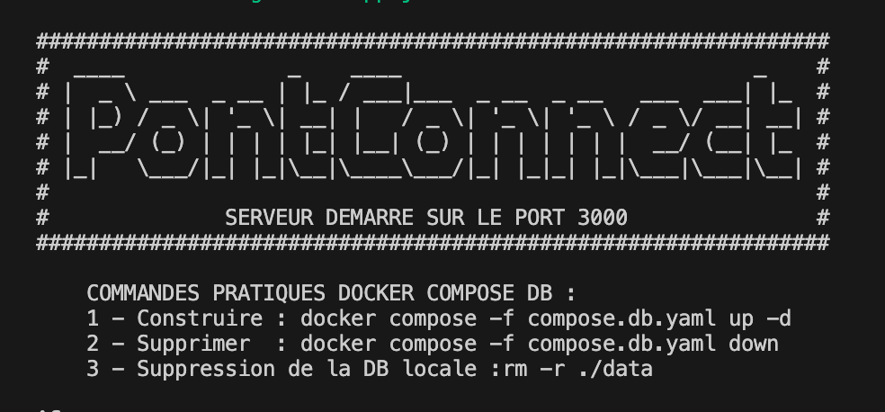

# BACKEND API REST PONTCONNECT

## Présentation du projet

PontConnect est une application mobile permettant aux propriétaires de bateaux de réserver des créneaux de passage aux ponts mobiles. Cette API REST, développée avec Node.js et Express, constitue le backend de l'application et permet de :

- Gérer les utilisateurs (inscription, authentification)
- Gérer les bateaux des utilisateurs
- Consulter les créneaux disponibles pour le passage des ponts
- Réserver des créneaux pour un bateau spécifique
- Suivre l'état des ponts via les données de capteurs
- Gérer les statuts des réservations (confirmation, annulation)

L'API est conçue pour fonctionner avec une base de données MySQL et s'intègre parfaitement avec l'application mobile Flutter.

**Aperçu du serveur en fonctionnement :**


## Pré-requis

1. Assurez-vous d'avoir [Node.js](https://nodejs.org/) (v14+) installé sur votre ordinateur.
2. Assurez-vous d'avoir [Docker Desktop](https://www.docker.com/products/docker-desktop/) installé sur votre ordinateur.
3. Un éditeur de code comme [Visual Studio Code](https://code.visualstudio.com/).

## Installation du projet

### Étape 1 : Clonage du projet
```bash
git clone https://github.com/wicra/PontConnect-REST-Node.git
cd PontConnect-REST-Node
```

### Étape 2 : Installation des dépendances
```bash
npm install
```

### Étape 3 : Configuration de l'environnement

Créez ou mettez à jour le fichier `.env` à la racine du projet avec les variables d'environnement requises

### Étape 4 : Démarrer la base de données avec Docker

Lancez le conteneur Docker pour la base de données MySQL et phpMyAdmin avec la commande suivante :
```bash
docker-compose -f compose.db.yaml up -d
```

**Remarque :**
 
- Cette commande construit et démarre le conteneur Docker avec les images nécessaires pour MySQL et phpMyAdmin.
- Accédez à phpMyAdmin via Docker Desktop en cliquant sur le lien fourni.
 
**Identifiants par défaut :**
- **Utilisateur :** `root`
- **Mot de passe :** `root`
- **Serveur :** `db`

Ces paramètres sont modifiables dans le fichier `compose.db.yaml`.

### Étape 5 : Démarrer le serveur

Avant de démarrer le serveur, vérifiez que Node.js et npm sont correctement installés :

```bash
    node -v
    npm -v
```

Démarrez ensuite le serveur backend avec :

```bash
    npm run start
```

## Quelque documentations utiles

- [Documentation Node.js](https://nodejs.org/docs/latest/api/)
- [Jointures](https://sql.sh/cours/jointures)
- [Docker](https://docs.docker.com/compose/)
